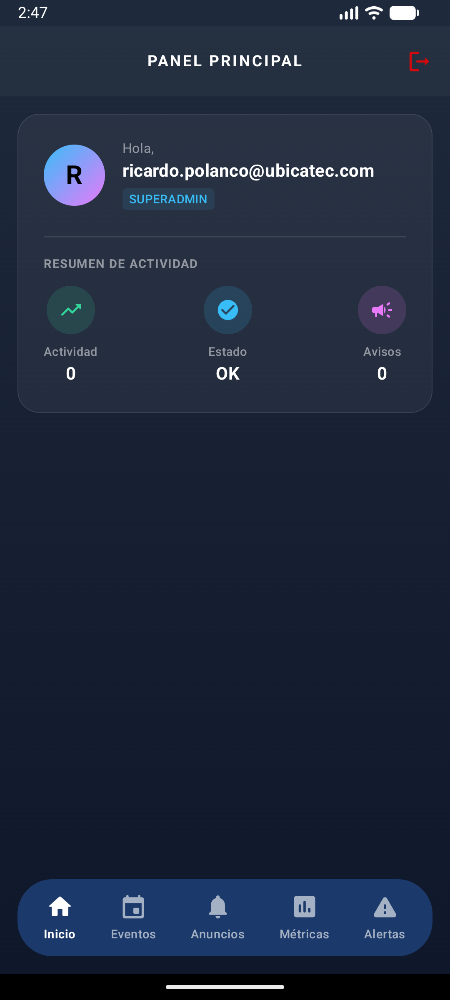
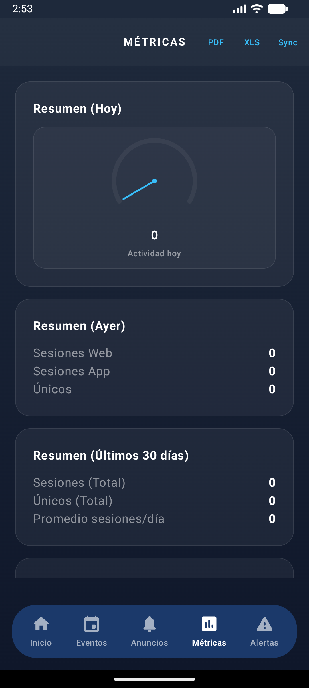
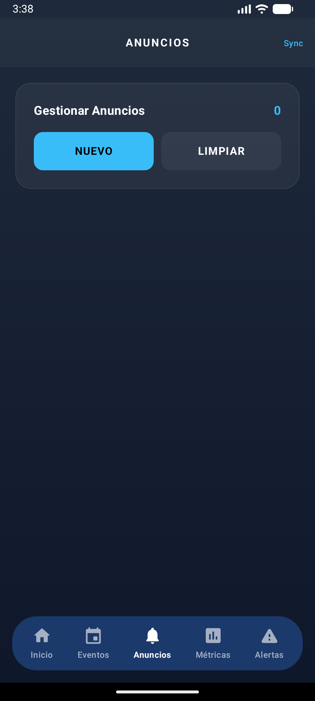
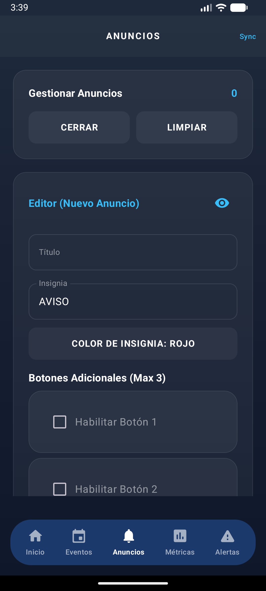
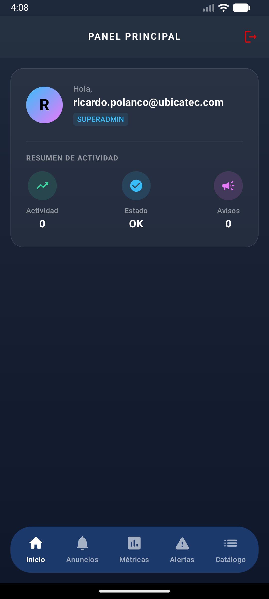
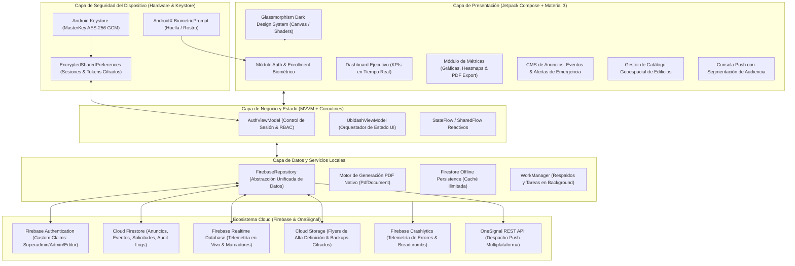

# UbiDash — Consola Administrativa & Telemetría Móvil de UBICATEC

<p align="center">
  
</p>

<p align="center">
  <strong>Plataforma nativa para Android desarrollada en Kotlin y Jetpack Compose para la gestión centralizada, telemetría en tiempo real, alertas de emergencia y administración del ecosistema UBICATEC en el Instituto Tecnológico de Puebla.</strong>
</p>

<p align="center">
  
  
  
  
  
  
</p>

---

> ### 🛡️ Nota de Propiedad Intelectual y Confidencialidad
> **UbiDash** y la suite de software **UBICATEC** son obras registradas y protegidas legalmente ante el **Instituto Nacional del Derecho de Autor (INDAUTOR)** en México.  
> Por motivos de estricta protección a la propiedad intelectual, seguridad de las credenciales institucionales y acuerdos de confidencialidad, **el código fuente completo se encuentra resguardado en un repositorio privado**.
>
> Este repositorio público constituye un **Estudio de Caso de Ingeniería de Software Móvil (*Mobile Architecture Case Study*)** y portafolio técnico, documentando la arquitectura de sistemas, diseño con Jetpack Compose, patrones de seguridad biométrica/criptográfica y la integración con servicios en la nube.

---

## 📱 Capturas de la Interfaz de Usuario

<table align="center">
  <tr>
    <td align="center" width="33%">
      <br>
      <b>Acceso Seguro & Biometría</b>
    </td>
    <td align="center" width="33%">
      <br>
      <b>Dashboard Ejecutivo en Vivo</b>
    </td>
    <td align="center" width="33%">
      <br>
      <b>Métricas & Mapa de Calor</b>
    </td>
  </tr>
  <tr>
    <td align="center" width="33%">
      <br>
      <b>CMS de Comunicados y Avisos</b>
    </td>
    <td align="center" width="33%">
      <br>
      <b>Editor Multimedia con Storage</b>
    </td>
    <td align="center" width="33%">
      <br>
      <b>Consola de Alertas de Emergencia</b>
    </td>
  </tr>
</table>

---

## 📌 1. Visión y Propósito del Sistema

El ecosistema **UBICATEC** atiende a miles de estudiantes, profesores y visitantes en el campus del Instituto Tecnológico de Puebla a través de su plataforma Web PWA y su aplicación móvil Android. Para mantener este ecosistema actualizado, sincronizado y seguro, se diseñó **UbiDash**.

**UbiDash** es el **centro de mando operativo (*Command Center*)** institucional. Desde esta aplicación nativa, las autoridades y administradores del campus pueden:
- Monitorizar en tiempo real el tráfico y los puntos de interés más concurridos del campus.
- Emitir comunicados institucionales y notificaciones push segmentadas en segundos.
- Activar protocolos de alerta de emergencia (alertas sísmicas, cierres temporales o contingencias climáticas).
- Administrar el catálogo geoespacial de edificios, aulas, laboratorios y sanitarios.
- Gestionar las jornadas tecnológicas, eventos académicos y conferencias del ITP.

---

## 🏛️ 2. Arquitectura de Software

La aplicación implementa una arquitectura limpia basada en **MVVM (Model-View-ViewModel)**, flujo reactivo con **Kotlin Coroutines / StateFlow**, inyección de configuración centralizada y componentes declarativos con **Jetpack Compose**:



---

## ⚡ 3. Módulos y Funcionalidades Destacadas

### 1. 📈 Motor de Telemetría y Analítica en Tiempo Real (`MetricsScreen.kt`)
- **Métricas Clave:** Análisis de usuarios activos diarios (DAU) y mensuales (MAU), páginas vistas totales y distribución por plataforma (Web PWA vs. Android Nativo).
- **Selector Temporal y Variación:** Análisis histórico en ventanas de **7, 30 y 90 días**, calculando de forma matemática la variación porcentual contra el periodo anterior equivalente (excluyendo días incompletos para no sesgar las proyecciones).
- **Mapa de Calor de Edificios:** Cruce dinámico de datos entre visitas por slug (`edificio_<id>`) y clics vectoriales en el mapa (`map_marker_click`), cruzados con la base de datos `edificios_min.json`.
- **Generador Nativo de Reportes PDF:** Implementación directa con `android.graphics.pdf.PdfDocument` para compilar informes directivos oficiales listos para imprimir o compartir, complementado con exportación a **CSV** para análisis en hojas de cálculo.

### 2. 🛡️ Seguridad Criptográfica y Control de Acceso (RBAC)
- **Autenticación Biométrica:** Integración con `androidx.biometric.BiometricPrompt` que permite un acceso ultrarrápido y seguro mediante lectores de huella o reconocimiento facial sin reintroducir contraseñas.
- **Almacenamiento Cifrado de Claves:** Uso de `EncryptedSharedPreferences` respaldado por el chip seguro del terminal (Android Keystore) con cifrado simétrico **AES-256 GCM**.
- **Roles y Permisos Granulares:** Validación de roles vía Firebase Custom Claims (`superadmin`, `admin`, `editor`), restringiendo funciones críticas (como la activación de alertas de evacuación o la gestión de usuarios) a perfiles autorizados.
- **Bitácora de Auditoría Inmutable:** Registro automático de cada acción en `admin_audit_logs` con sello de tiempo, UID del operador y detalles de la operación.

### 3. 📢 Gestor de Contenido (CMS) y Alertas de Emergencia
- **Avisos Institucionales:** Creación de comunicados con título, cuerpo enriquecido, fecha de vencimiento y subida de fotografías en alta resolución a Cloud Storage.
- **Alertas Críticas:** Consola de emisión inmediata con protocolos preconfigurados (Alerta Sísmica, Contingencia Ambiental, Suspensión de Labores). Al activarse, dispara una notificación push con prioridad máxima a todos los dispositivos suscritos.
- **Jornadas y Eventos:** Control integral del calendario académico, conferencias magistrales, talleres, sedes y ponentes invitados.

### 4. 🔔 Despachador de Notificaciones Push
- Envío directo de notificaciones push a través de OneSignal API v5 y Firebase Cloud Messaging.
- **Segmentación de Audiencia:** Capacidad de enviar campañas masivas a:
  - 🌐 *Usuarios Web (PWA)*
  - 📱 *Usuarios de la App Móvil Android*
  - 📢 *Comunidad Completa*

---

## 🛠️ 4. Ficha Técnica

| Parámetro | Especificación | Descripción |
| :--- | :--- | :--- |
| **Nombre del Proyecto** | `UbiDash` | Consola administrativa y de control de UBICATEC |
| **Package Name / ID** | `mx.tecnm.puebla.ubicatec.admin` | Identificador de aplicación Android |
| **Lenguaje de Programación** | `Kotlin 2.0.21` | Lenguaje nativo con soporte para Compose Compiler Plugin |
| **Toolkit de UI** | `Jetpack Compose + Material 3` | Compose BOM `2024.06.00` con arquitectura declarativa |
| **Versión de SDK** | Compile / Target SDK `34` (Android 14) · Min SDK `24` | Cobertura desde Android 7.0 hasta versiones recientes |
| **Arquitectura** | MVVM + Repository Pattern | Separación estricta de UI, Estado y Servicios de Datos |
| **Asincronía & Estado** | `Coroutines` + `StateFlow` + `SharedFlow` | Gestión reactiva de flujos y operaciones no bloqueantes |
| **Seguridad & Criptografía** | `androidx.biometric` + `androidx.security.crypto` | Desbloqueo biométrico y almacenamiento seguro Keystore AES-256 |
| **Suite Backend** | `Firebase BOM 33.8.0` | Auth, Firestore (Offline persistente), RTDB, Storage, Crashlytics |
| **Carga de Imágenes** | `Coil Compose 2.6.0` | Carga asíncrona, transformación y caché eficiente en memoria |
| **Exportación de Documentos** | `android.graphics.pdf.PdfDocument` | Compilación nativa vectorial de informes ejecutivos |

---

## 📂 5. Estructura del Código Fuente

```
UbiDash/
├── app/
│   ├── src/main/
│   │   ├── java/mx/tecnm/puebla/ubicatec/admin/
│   │   │   ├── AdminApp.kt                    # Inicialización de Firebase, Firestore offline y Crashlytics
│   │   │   ├── MainActivity.kt                # Controlador de navegación y motor de exportación PDF
│   │   │   ├── model/                         # Data classes (Eventos, Anuncios, Métricas, Roles)
│   │   │   ├── repository/                    # FirebaseRepository y capa de datos
│   │   │   ├── viewmodel/                     # ViewModels reactivos (Auth, Dashboard)
│   │   │   ├── utils/                         # CryptoUtils (AES-256), AppLogger, formateadores
│   │   │   └── ui/                            # Pantallas modulares en Jetpack Compose
│   │   │       ├── auth/                      # Login con Biometría y validación de Claims
│   │   │       ├── dashboard/                 # Panel de control ejecutivo
│   │   │       ├── metrics/                   # Telemetría, gráficas, heatmaps y reportes
│   │   │       ├── announcements/             # CMS de avisos y editor multimedia
│   │   │       ├── alerts/                    # Consola de alertas de emergencia sísmica/campus
│   │   │       ├── events/                    # Gestor de eventos y conferencias de jornadas
│   │   │       ├── catalog/                   # Catálogo geoespacial de aulas y edificios
│   │   │       ├── notifications/             # Despachador de notificaciones push segmentadas
│   │   │       ├── users/                     # Administración de usuarios y roles (RBAC)
│   │   │       ├── requests/                  # Bandeja de solicitudes estudiantiles
│   │   │       ├── logs/                      # Bitácora de auditoría inmutable
│   │   │       └── settings/                  # Configuración del sistema y biometría
│   │   ├── res/                               # Recursos nativos (iconos, temas, strings i18n)
│   │   ├── assets/                            # Catálogo geoespacial base (edificios_min.json)
│   │   └── AndroidManifest.xml                # Declaración de componentes y permisos
│   └── build.gradle.kts                       # Configuración de dependencias Kotlin/Compose/Firebase
└── settings.gradle.kts                        # Configuración de módulos del proyecto
```

---

## 🌐 6. El Ecosistema UBICATEC

Este proyecto forma parte de la suite tecnológica integral desarrollada para el Instituto Tecnológico de Puebla:

- 🌐 **[UBICATEC Web PWA](https://github.com/Richpol99/ubicatec-showcase):** Plataforma web progresiva de orientación espacial para estudiantes y docentes.
- 📱 **[UBICATEC Android](https://github.com/Richpol99/ubicatec-android-showcase):** Aplicación móvil nativa para estudiantes con Widgets de escritorio y modo inmersivo.
- 📊 **[UbiDash (Este Repositorio)](https://github.com/Richpol99/ubicatec-admin-showcase):** Consola administrativa nativa en Jetpack Compose para gestión de contenidos, telemetría y alertas.

---

## 👨‍💻 7. Autoría y Créditos

- **Desarrollador Principal:** Ricardo Armando Polanco Villa ([@Richpol99](https://github.com/Richpol99))
- **Institución:** Instituto Tecnológico de Puebla (ITP)
- **Registro de Obra:** Instituto Nacional del Derecho de Autor (**INDAUTOR**, México)
